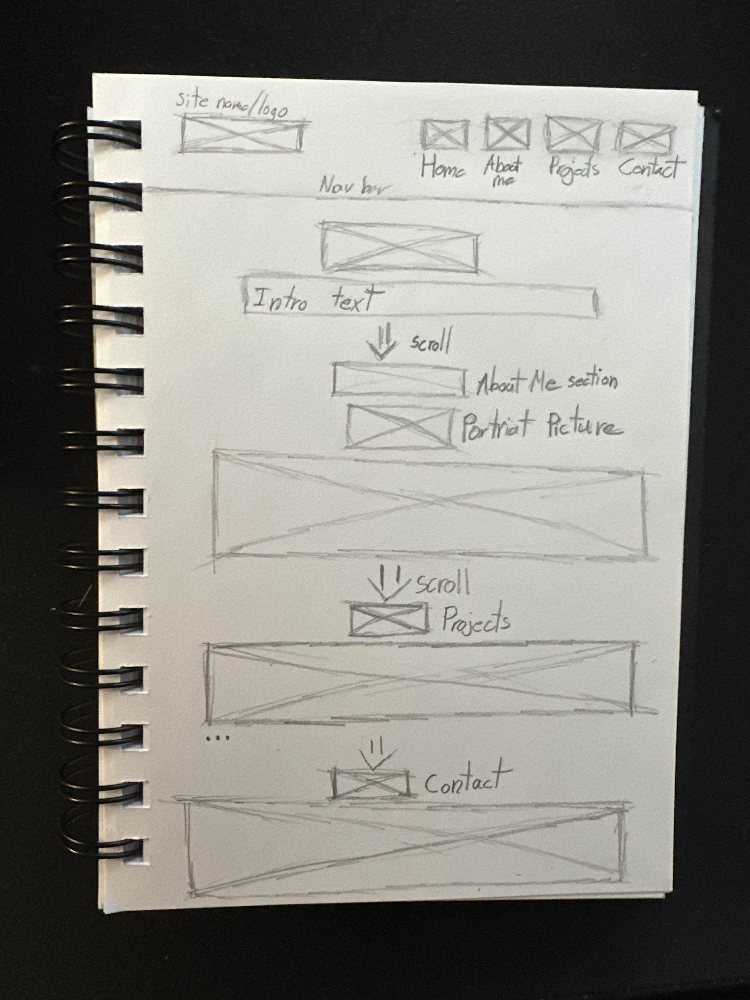

# Isaac Jones Mini Project

## Project Details

I wanted to use this opportunity to build a personal portfolio website. I believe this is a smart way to not only learn the basics of HTML, CSS, and JavaScript, but also to create a space where I can showcase my past projects and share a bit about myself with future employers.

## Tech Stack

This website is built using the following technologies:

- **Tailwind CSS** — for utility-first CSS styling  
- **React.js** — for building the front-end components and UI  
- **Cypress** — for end-to-end testing  
- **GitHub Actions** — for continuous integration and automated workflows  
- **AWS Amplify** — for site deployment and hosting  

I chose this stack to keep the project simple and modern, while using tools that are well-supported and aligned with current best practices.  
Additionally, I chose this tech stack to reflect the technologies I’ll be using with my main project group.

## Low Fidelity Wireframe

At the top will be the navigation bar. On the left, I will either have a logo or just my name — clicking it will bring you to the landing page.  
To the right on the nav bar will be four buttons: Home, About Me, Projects, and Contact. Each of these, once clicked, will bring you to that section.

Under the navigation bar will be a welcome message. Under that, where it says “intro text,” will be a short description of myself.  
Scroll down to reveal the About Me section. I will include a picture of myself, and underneath that a more in-depth and personal description, along with links to my external pages.

Scroll further to find the Projects section. Here I will outline my projects. In the wireframe, I added “...” underneath to indicate that the more projects I include, the more boxes I’ll need.

Scroll more to find the **contact** section at the bottom. Here, I either want to have a form to fill out or just list my contact information and how to get a hold of me.

